# Introduccióna Git

## ¿Qué es Git y por qué deberías usarlo?

Git es un sistema de control de versiones distribuido ampliamente utilizado en el desarrollo de software. Permite rastrear y gestionar los cambios realizados en archivos a lo largo del tiempo. A diferencia de los enfoques tradicionales, como copiar y pegar archivos o usar carpetas con diferentes versiones, Git proporciona un historial detallado de cada modificación, quién la realizó y la capacidad de volver atrás en el tiempo si es necesario.

Algunas razones por las que deberías considerar utilizar Git en tus proyectos son las siguientes:

- **Control de versiones**: Git registra todos los cambios realizados en tus archivos, lo que te permite visualizar el historial completo del proyecto y acceder a cualquier versión anterior. Esto facilita la colaboración en equipo, ya que cada desarrollador puede trabajar en su propia rama y fusionar los cambios de manera eficiente.

- **Colaboración**: Git fomenta la colaboración entre desarrolladores. Varios miembros del equipo pueden trabajar simultáneamente en diferentes características o soluciones de problemas, y luego combinar sus cambios de manera sencilla y sin conflictos. Además, Git facilita la revisión y el intercambio de código entre los miembros del equipo.

- **Ramificación (branching)**: Una de las características más poderosas de Git es la capacidad de crear ramas independientes. Esto te permite trabajar en nuevas funcionalidades o experimentar sin afectar la rama principal del proyecto. Las ramas pueden fusionarse o eliminarse una vez que el trabajo esté completo, brindando flexibilidad y organización al proceso de desarrollo.

- **Recuperación ante errores**: Git te permite deshacer cambios no deseados o errores cometidos en el código. Puedes revertir a versiones anteriores, lo que es especialmente útil si algo sale mal. Esto ayuda a evitar pérdidas de datos y proporciona una forma segura de experimentar y corregir problemas.

- **Integración con servicios en la nube**: Git se integra con plataformas populares de alojamiento de repositorios, como GitHub y GitLab. Estas plataformas ofrecen herramientas adicionales para administrar proyectos, realizar seguimiento de problemas, facilitar revisiones de código y colaborar con otros desarrolladores.

En resumen, Git es una herramienta esencial para cualquier desarrollador de software debido a su capacidad de control de versiones, facilitación de la colaboración en equipo, ramificación flexible, recuperación ante errores y su integración con plataformas en la nube. Su adopción te permitirá mejorar la eficiencia y organización en tus proyectos, además de proporcionar una forma segura y confiable de gestionar tus cambios de código.

## Instalación de Git en Windows

La instalación de Git en Windows es un proceso sencillo, descargaremos un instalador y prácticamente será siguiente,siguiente :

1. **Descargar el instalador**: Accede al sitio web oficial de Git (<www.git-scm.com>) y ve a la sección de descargas. Haz clic en el enlace correspondiente a la versión de Windows y descarga el instalador.

2. **Ejecutar el instalador**: Una vez que se haya completado la descarga, ejecuta el archivo del instalador. Aparecerá una ventana de configuración que te guiará durante el proceso de instalación.

3. **Aceptar los términos de la licencia**: Lee los términos de la licencia de Git y, si estás de acuerdo, marca la casilla correspondiente y haz clic en "Siguiente" para continuar.

4. **Seleccionar la ubicación de instalación**: Elige la ubicación en la que deseas instalar Git o simplemente mantén la configuración predeterminada. Haz clic en "Siguiente" para avanzar.

5. **Seleccionar los componentes**: Aquí puedes elegir los componentes adicionales que deseas instalar. A menos que tengas un motivo específico para cambiarlo, es recomendable dejar las opciones predeterminadas seleccionadas. Haz clic en "Siguiente".

6. **Seleccionar el editor de texto predeterminado**: Git utiliza un editor de texto para mostrar información adicional. Puedes optar por utilizar el editor predeterminado o elegir uno diferente instalado en tu sistema. Haz clic en "Siguiente" cuando hayas realizado tu elección.

7. **Configurar el PATH del sistema**: En esta pantalla, puedes elegir si deseas añadir Git al PATH del sistema. Se recomienda seleccionar "Usar Git desde el símbolo del sistema" para facilitar el uso de Git desde la línea de comandos. Haz clic en "Siguiente".

8. **Configurar la terminal de línea de comandos**: Puedes elegir el emulador de terminal que prefieras. Si no estás seguro, deja la opción predeterminada y haz clic en "Siguiente".

9.  **Configurar la interfaz de línea de comandos**: Aquí puedes elegir el estilo de interacción con la línea de comandos. La opción predeterminada es "Usar Git Bash", que proporciona una experiencia similar a la terminal de Unix. Haz clic en "Siguiente".

10. **Configuración adicional**: En esta pantalla, puedes elegir si quieres habilitar el soporte experimental de Git para Windows Subsystem for Linux (WSL). Si no tienes experiencia con WSL, es recomendable dejar la opción desactivada. Haz clic en "Siguiente".

11. **Instalación**: Finalmente, haz clic en "Instalar" para comenzar la instalación de Git en tu sistema. Una vez que se complete la instalación, haz clic en "Siguiente" y luego en "Finalizar".

¡Y eso es todo! Git se ha instalado correctamente en tu sistema Windows. Ahora puedes acceder a Git a través de la línea de comandos o utilizar una interfaz gráfica si lo prefieres. Para verificar la instalación, abre una ventana de símbolo del sistema y escribe "git --version". Deberías ver la versión de Git instalada.

Espero que esta guía te haya sido útil para comprender qué es Git y cómo instalarlo en Windows. ¡Ahora estás listo para empezar a aprovechar todos los beneficios que Git ofrece en tus proyectos de desarrollo!

## Capturas Instalación de la versión 2.41.0 para Windows

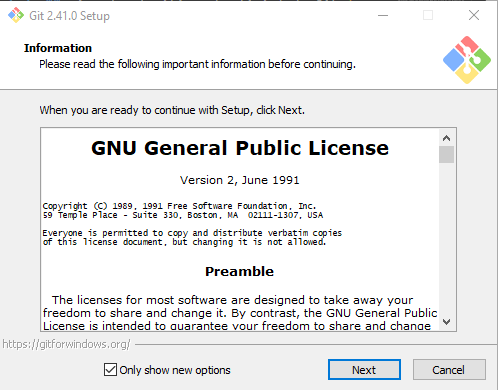
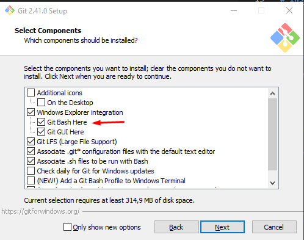
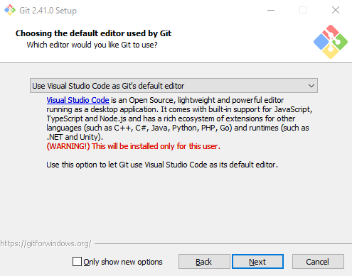
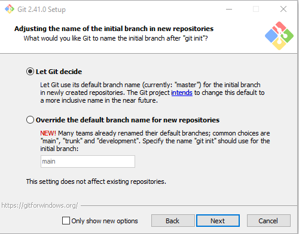
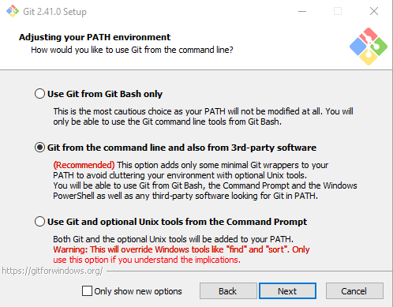
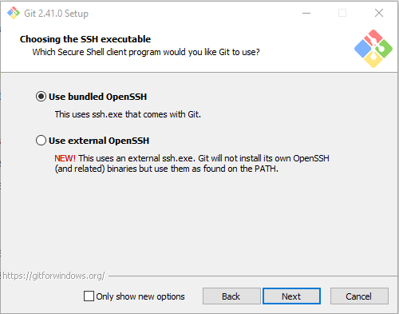

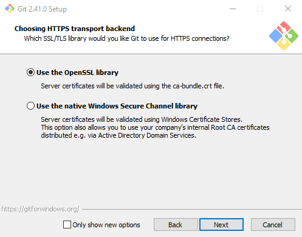
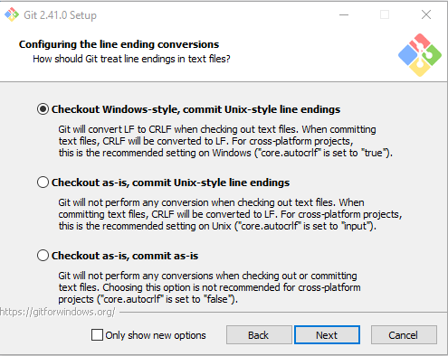
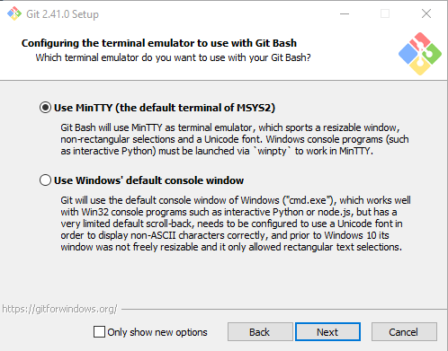
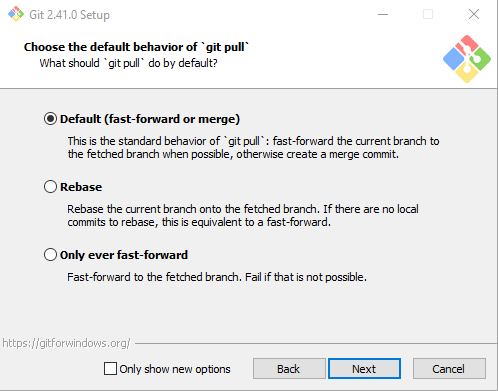
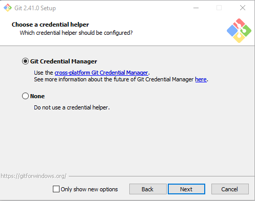
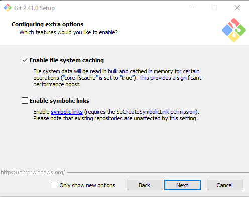
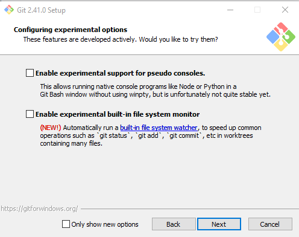
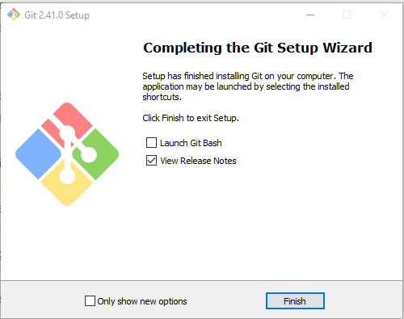
